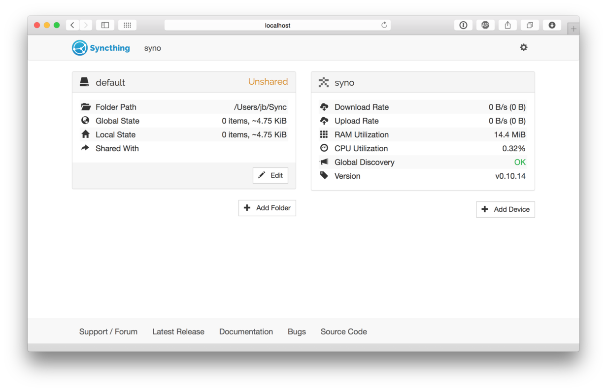
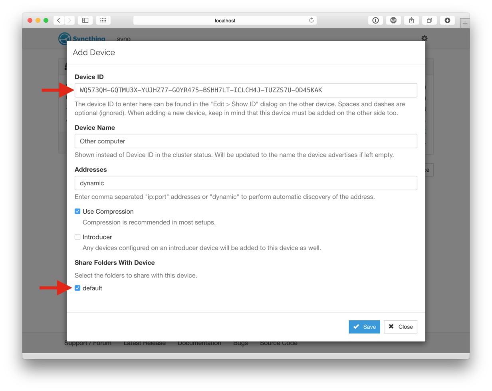
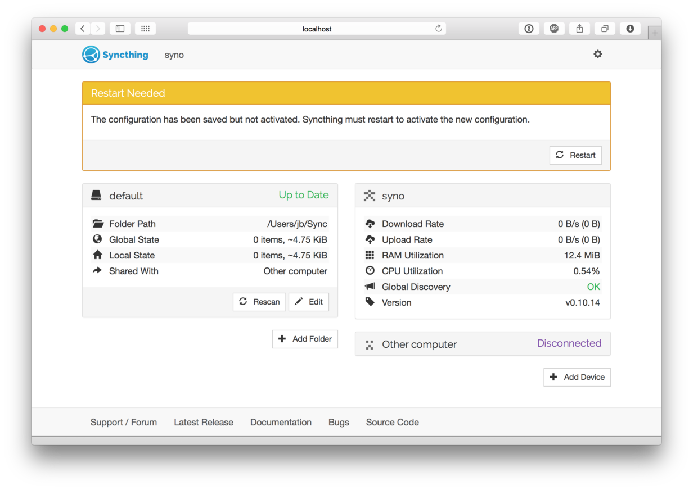
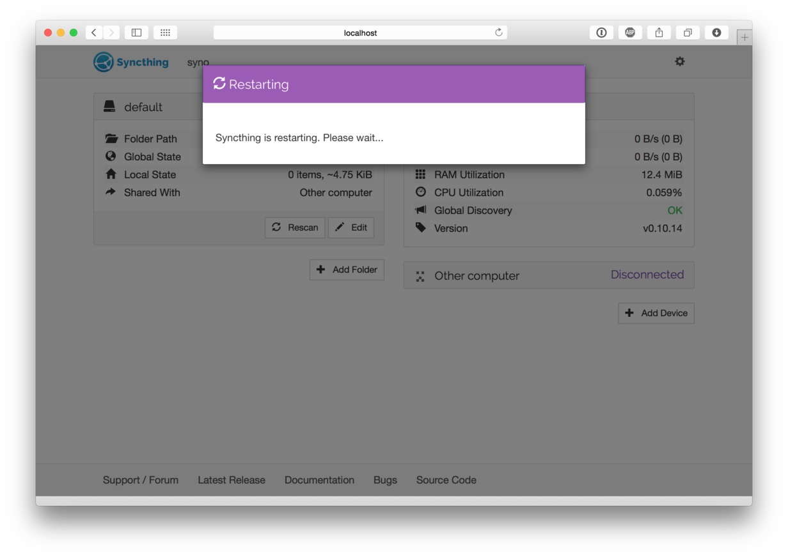

For this guide let's assume you have two machines between which you want to synchronise files. In keeping with Syncthing terminology they are going to be called "devices" in the rest of the documentation. The "local device" is the one you are configuring, viewing status for, etc, while the "remote device" is the other machine.

The best way to follow this guide is to do the install on both machines and configure them in parallel. If both machines aren't accessible simultaneously that's fine, the results will just be a little less immediately obvious.

## Installing

We suggest you have a look to many of the [community contributions](https://github.com/syncthing/syncthing/wiki/Community-Contributions) which let you pick a flavor of Syncthing that best fits your scenario. For example, if you are interested in a cross-platform GUI application you can check out [Syncthing-GTK](https://github.com/syncthing/syncthing-gtk). The community has also developed [Windows](https://github.com/syncthing/syncthing/wiki/Community-Contributions#windows), [Android](https://github.com/syncthing/syncthing/wiki/Community-Contributions#android) ([Play](https://play.google.com/store/apps/details?id=com.nutomic.syncthingandroid&hl=nl_BE) & [F-Droid](https://f-droid.org/repository/browse/?fdfilter=syncthing&fdid=com.nutomic.syncthingandroid) store) and [many more](https://github.com/syncthing/syncthing/wiki/Community-Contributions) specific flavors that help you run Syncthing on your devices. Currently all community flavors run the same Syncthing core underneath, so don't worry about changing your flavor at a later point in time. The remainder of this page will explain how to set up two devices with the core Syncthing flavor.

### Syncthing

Grab the [latest release](https://github.com/syncthing/syncthing/releases/latest) of Syncthing for your operating system at  and unpack it. There will be a binary called `syncthing` (or `syncthing.exe` on Windows). Start this in whatever way you are most comfortable with; double-clicking should work in any graphical environment, but I'll use the terminal to better illustrate what happens. At first start, Syncthing will generate a configuration and some keys and then start the admin GUI in your browser. Something like the following will be printed in the terminal:

```
$ syncthing
[monitor] 15:56:58 INFO: Starting syncthing
15:56:58 INFO: Generating RSA key and certificate for syncthing...
[ANSMX] 15:57:05 INFO: syncthing v0.10.14 (go1.4 darwin-amd64 default) jb@syno...
[ANSMX] 15:57:05 INFO: My ID: ANSMXYD-E6CF3JC-TCVPYGF-GXJPHSJ-MKUXBUQ-ZSPOKXH-...
[ANSMX] 15:57:05 INFO: No config file; starting with empty defaults
[ANSMX] 15:57:05 INFO: Edit gs1/config.xml to taste or use the GUI
[ANSMX] 15:57:05 INFO: Starting web GUI on http://127.0.0.1:8384/
[ANSMX] 15:57:05 INFO: Loading HTTPS certificate: open gs1/https-cert.pem: no ...
[ANSMX] 15:57:05 INFO: Creating new HTTPS certificate
[ANSMX] 15:57:05 INFO: Generating RSA key and certificate for syno...
[ANSMX] 15:57:07 INFO: Starting UPnP discovery...
[ANSMX] 15:57:13 INFO: UPnP discovery complete (found 0 devices).
[ANSMX] 15:57:13 INFO: Starting local discovery announcements
[ANSMX] 15:57:13 INFO: Local discovery over IPv4 unavailable
[ANSMX] 15:57:13 INFO: Starting global discovery announcements
[ANSMX] 15:57:13 OK: Ready to synchronize default (read-write)
[ANSMX] 15:57:13 INFO: Device ANSMXYD-E6CF3JC-TCVPYGF-GXJPHSJ-MKUXBUQ-ZSPOKXH-...
[ANSMX] 15:57:13 INFO: Completed initial scan (rw) of folder default
```

At this point Syncthing will also have set up a folder called `default` for you, in a directory called `Sync` in your home directory. You can use this as a starting point, then remove it or add more folders later.

## Configuring

The admin GUI starts automatically and remains available on `http://localhost:8384/`. It should look something like this:



On the left is the list of "folders", or directories to synchronize. You can see the `default` folder was created for you, and it's currently marked "Unshared" since it's not yet shared with any other device. On the right is the list of devices. Currently there is only one device: the computer you are running this on.

For Syncthing to be able to synchronize files with another device, it must be told about that device. This is accomplished by exchanging "device IDs". A device ID is a unique, cryptographically-secure identifier that is generated as part of the key generation the first time you start Syncthing. It is printed in the log above, and you can see it in the web GUI by selecting the "gear menu" (top right) and "Show ID".

Two devices will *only* connect and talk to each other if they both know about the other's device ID. Since the configuration must be mutual for a connection to happen, device IDs don't need to be kept secret.

To get your two devices to talk to each other, click "Add Device" at the bottom right on both, and enter the device ID of the other side. You should also select the folder(s) that you want to share with this device. The device name is optional, but you can set it to something that makes sense for you to remember what device this is.



Once you click "Save" the new device will appear on right side of the GUI (although disconnected) and a prompt will be shown to indicate the need for a restart.



Syncthing needs to be restarted for some configuration changes to take effect (such as sharing folders with new devices). When you click "Restart" Syncthing will first restart&hellip;



&hellip; then come back up and after a while (up to a minute) connect to the other device. Remember though that you need to do the above process on both devices, and only once you've done this on both devices will they be able to connect.


At this point the two devices share an empty directory. Adding files to the Sync directory on either device will synchronize those files to the other side. Each device scans for changes every 60 seconds, so changes can take a little over a minute to propagate to the other side. The rescan interval can be changed for each folder by clicking on a folder, clicking "Edit" and entering a new value for "Rescan Interval".

---

Good luck and have fun! There is more [documentation](https://github.com/syncthing/syncthing/wiki) and if you run into trouble feel free to post a question in the [support forum](http://forum.syncthing.net/category/support). If you have problems getting this to connect, first take a look at [Firewalls and Port Forwards](https://github.com/syncthing/syncthing/wiki/Firewalls-and-Port-Forwards), then look at any error messages in the GUI or on the console and if necessary move on to [Debugging](https://github.com/syncthing/syncthing/wiki/Debugging).
