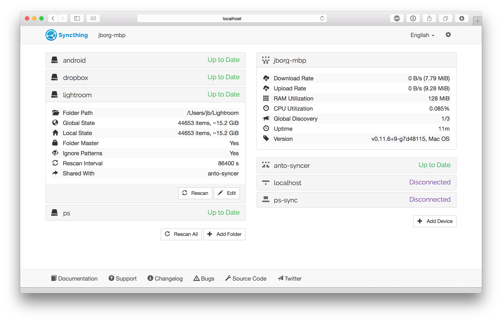

## Local State

Left side of the screen shows the local state (your device state).  You can
see a list of folders you have, and as you click on one folder name, it
expands to show you about that folder. Next to folder name, you can will see
the state of the folder:

 - *Unknown* while the GUI is loading.
 - *Unshared* when you have not shared this folder,
 - *Stopped* when the folder has experienced an error,
 - *Scanning* while the folder is lookign for local changes,
 - *Up to Date* when the folder is in sync with the rest of the cluster,
 - *Syncing* when this device is downloading changes from the network.

In the information about each folder, you can see information about number of
files and the size of folder:

 - *Global State* indicates how many files there are between all devices in this folder - this is the currently desired state for each device.
 - *Local State* shows how many files this devices currently has.

If the size of the *local state* is lower than the
*global state* this implies that the folder it's not yet synchronized, or that
you have defined *ignore patterns* and not all files for the given folder will
be synchronized.

## Remote State

Bottom right side of the screen shows the overall state of the remote devices
(overall completion percentage over all of the common folders between your
device and the remote device.)

If a device has one or more folders to sync, you will see it with status
*Syncing* and a percentage indicating its progress.
